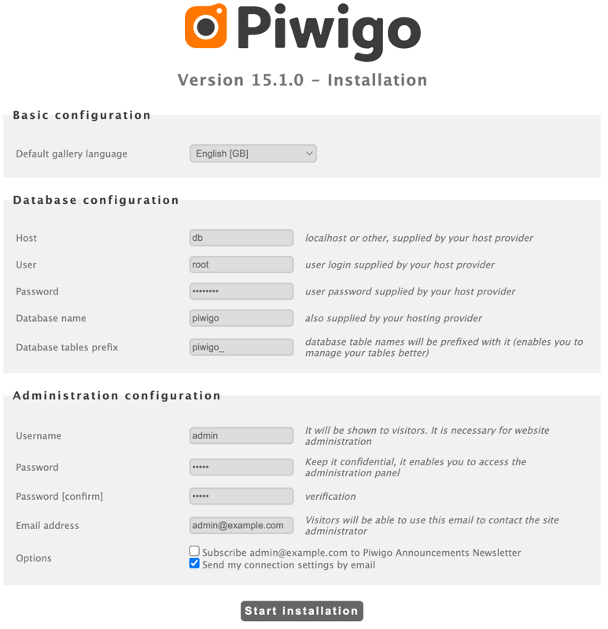
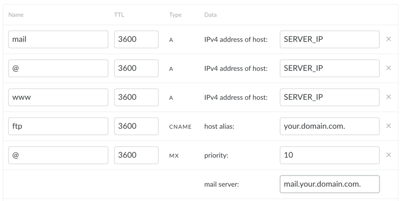

# Installing Piwigo instance on Hetzner cloud
## Prerequisites
* Unix/Linux shell
* Installed [Terraform](https://developer.hashicorp.com/terraform/install) and SSH
* [Docker Hub](https://app.docker.com/signup) account
* Hetzner cloud account and [access token](doc/access_token.md) for its API
* The domain name you own and access to its DNS records

## Installing
All steps must be executed in the folder where you checked out the sources.
1. Generate a key pair and put the public key in the `.mysecrets` working folder.
`mkdir .mysecrets | ssh-keygen -f ./.mysecrets/id_rsa_piwigo`
2. Copy `terraform.tfvars.example` to `terraform.tfvars` and replace the values accordingly:
    * Hetzner API token 
    * master public key filename
    * Docker Hub credentials
    * server [instance type](https://www.hetzner.com/cloud/) (for example, "cax11" for ARM or CX22 for Intel CPU) and location
    * a password for the `root` MySQL user (choose whatever you like) that MySQL will use to create the database. 
3. Run `terraform init`
4. Run `terraform apply`, it takes a couple of minutes to install
5. Go to the Hetzner Cloud console and find the server's public IP (*SERVER_IP*).
6. Open the browser and visit [http://*SERVER_IP*:8088](), the Piwigo's installation page should display
7. Insert values as on the picture using the mysql_password you specified in `terraform.tfvars`.

Choose arbitrary administrator username, password and email; the rest of values as on the picture.
8. Click "Start installation"

## Updating DNS records
Go to your DNS admin page and add the necessary records like in the following example replacing "*SERVER_IP*" and "*your.domain.com*" with actual numbers and domain name:

After applying (it is not quick and may take some time to propagate) visit [http://*your.domain.com*:8088]() to check that DNS works.

## Generating Letsencrypt certificate
Run `local-request-certbot.sh`:
`SERVER=*your.domain.com* EMAIL=*domainowner@example.com* ./local-request-certbot.sh`
Don't forget to run it again before the certificate expires (3 months).
After that your site should be available at [https://*your.domain.com*]()

Your Piwigo installation is ready to use, you can log in as admin and continue configuring it.